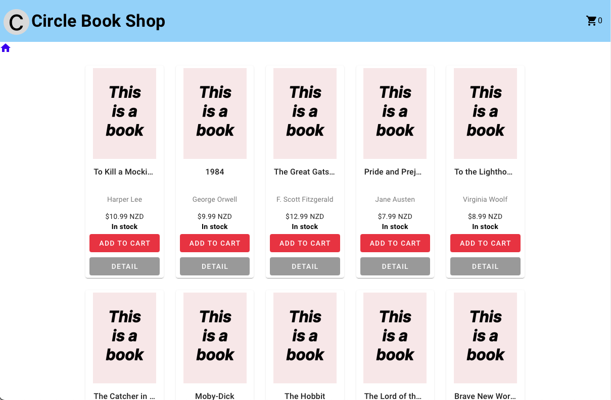

# circle-book 

This is a simple [bookshop website ]([https://www.google.com](https://main--famous-valkyrie-5fb6b1.netlify.app) "Circle bookshop").

## About The Project



The landing page shows all the available books (if it's not in stock, it will be highlighted  with "No stock" in red). Customers can add a book to the shopping cart OR on the detail page. They can visit the detail page by clicking "Detail" button.

The detail page contains more information (e.g. ISBN) and "Purchase now" button. Once customers buy it, it will pop up a message showing successful, and the availability will be updated instantly. If customers buy the last book, "Purchase now" button will be disabled, and "Add to Cart" button will change to "Out of Stock".

Please note that the shopping cart at this stage only shows how many books are being added but cannot be used for purchase. 

## Recommended IDE Setup

[VSCode](https://code.visualstudio.com/) + [Volar](https://marketplace.visualstudio.com/items?itemName=Vue.volar) (and disable Vetur) + [TypeScript Vue Plugin (Volar)](https://marketplace.visualstudio.com/items?itemName=Vue.vscode-typescript-vue-plugin).

## Customize configuration

See [Vite Configuration Reference](https://vitejs.dev/config/).

## Project Setup

```sh
npm install
```

### Compile and Hot-Reload for Development

```sh
npm run dev
```

### Compile and Minify for Production

```sh
npm run build
```
